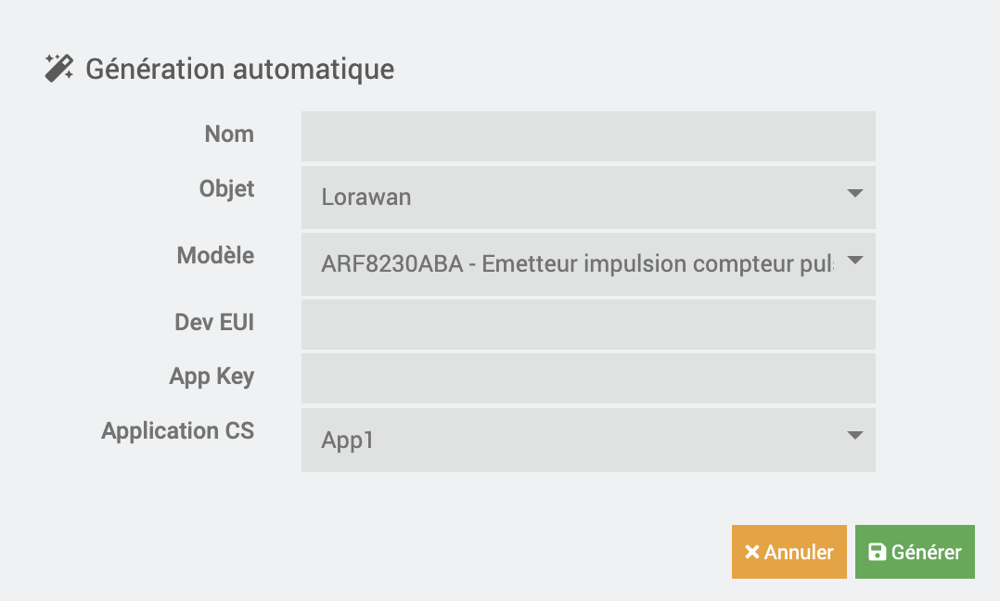
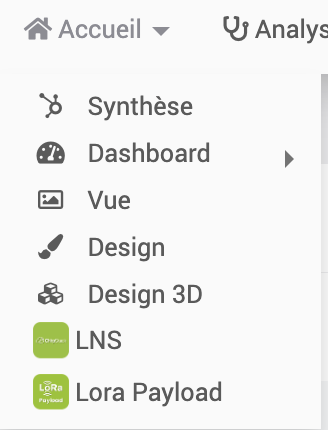
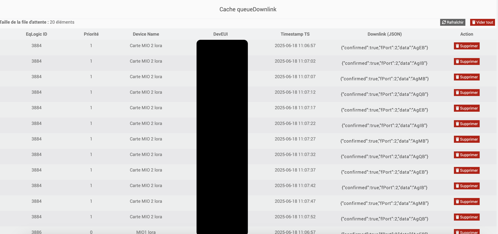

# Complemento LoraPayload

Este complemento es un complemento que permite vincular los comandos de carga útil de LoraWan y crear un dispositivo con comandos mientras se analizan los valores.

# Configuration

## Configuración del complemento

Puede verificar el estado de las dependencias aquí y relanzarlas. En caso de problemas con el complemento, reinicie siempre las dependencias incluso si está bien si hay dudas.


# El complemento

Vaya al menú de complementos / protocolo para encontrar el complemento.

En esta página puedes ver los módulos ya incluidos.

En la parte superior de esta página tienes varios botones

-   **Botón Agregar** : Le permite agregar equipo
-   **Botón de configuración** : Este botón abre la ventana de configuración del complemento
-   **Bonton Génération automatique** : Permet d'ajouter un nouvel équipement dans jeedom et sur chirpstack. ( Recommandé pour l'ajout d'équipement )

# Equipement

Cuando haces clic en uno de tus módulos, llegas a su página de configuración :

-   Dar un nombre al módulo
-   Activar / hacer visible o no
-   Elija su objeto padre
-   Asignarle una categoría

En el lado derecho encontrarás :

-   El perfil del equipo (a elegir manualmente por el usuario al crear)
-   Ver lo visual

También tienes dos pestañas adicionales:

-   Una pestaña de Carga útil (descrita en el siguiente párrafo)
-   Una pestaña de Órdenes (aquí es donde encontrará los controles correspondientes a su equipo; esta pestaña es estándar en Jeedom)

# Agregar equipo

Il suffit de cliquer sur le bouton `Génération automatique` et de choisir un nom.
Ensuite vous pouvez configurer l'objet Parent, renseigner le Dev EUI l'app Key, l'application pour chirpstack
Pour configurer, activer l'équipement, choisir une ou des catégories, et rendre l'équipement visible ou non.

Es importante en el lado derecho elegir el tipo de equipo. Esto es lo que permitirá saber cómo analizar el marco.

L'onglet LoRaWAN est très important :

-   Vous devez choisir la commande info qui reçoit le payload que ce soit MQTT ou autres ( important si vous avez utilisé le bouton `Ajouter` sinon avec `Génération automatique` tout est généré automatiquement )
-   Vous pouvez choisir si le format du payload est en Hexadécimal ou Base64.
-   Avec Euqueue downlink payload, vous pouvez envoyer des downlinks manuellement.


Una vez hecho esto, puedes guardar. A continuación, la próxima vez que reciba un marco, se actualizarán los comandos de su equipo

# Envoyer des commandes

Certains modules Lorawan possèdent des commandes de type Action qui permettent d'envoyer des consignes aux modules via l'interface Jeedom.

Dans l'onglet Equipement du plugin LoraPayload :

- Vous devez choisir la commande d'envoi (que ce soit MQTT ou autres)
- Vous devez choisir si voulez avoir une confirmation (Ack). C'est une information remontée dans MQTT sur un topic dédié qui n'influence pas les données remontées.
Concernant la commande d'envoi, dans le cas d'utilisation de MQTT, c'est une commande dans MQTT de type Action et de sous-type Message. Le topic est le topic dédié aux downlinks et la valeur de la commande est *message*.
---
# Ajouter un nouveau capteur Milesight (downlink/uplink)

Cette section détaille **l'ajout de la configuration et de la gestion des commandes (uplink/downlink) pour un capteur Milesight** dans le plugin LoraPayload.

---

## 1. Ajout des fichiers d'encodage/décodage 

1. **Créer un fichier JavaScript** nommé selon la convention suivante :  
   `milesight_modele.js`  
   Exemple :  
   - `milesight_WT101.js`  
   - `milesight_GS601.js`

2. **Déposer ce fichier dans** :  
   `/var/www/html/plugins/lorapayload/resources/lorapayload/payloads/`

3. **Fusionner le code d'encodage (encoder) et décodage (decoder) dans ce même fichier**.

---

## 2. Adapter la fonction Decode

Remplacer :
```js
function Decode(fPort, bytes) {
    return milesightDeviceDecode(bytes);
}
Par 
function Decode(input) {
    bytes = input.bytes;
    return milesightDeviceDecode(bytes);
}
```

---

## 3. Adapter la fonction Encoder

Remplacer :
```js
function Encode(fPort, obj, variables) {
return milesightDeviceEncode(obj);
}
Par 
function Encode(obj) {
    return milesightDeviceEncode(obj);
}
```
## 4. Explorter les fonctions 
A la fin du fichier, ajouter:
```js
module.exports = {
    Decode,
    Encode
};
```
## 5. Déclaration du capteur dans la configuration

1. **Créer un dossier** dans ``/var/www/html/plugins/lorapayload/core/config/devices/ ``qui porte le même nom que votre fichier d'encodage/décodage (sans l'extension ``.js``).

2. Ajouter dans ce dossier :

- Un fichier JSON de configuration du même nom que le JS

- Une image PNG du capteur (format recommandé : 250x250 px)

## 6. Exemple de configuration JSON pour un capteur Milesight 
```json
{
  "milesight_GS601": {
    "name": "Milesight GS601 - Vape Detector",  // Modele + Nom du capteur 
    "groupe": "Milesight",      //Nom du Fabricant
    "configuration": {
      "type": "milesight_GS601",
      "language": "js",         // Indique que l'encodeur/décodeur est en JS (sinon omettre)
      "deviceProfile": "C"      // Indique que le profil LoRaWAN du device est "Class C" (sinon omettre)
    },
    "commands": [
      {
        "name": "Température",  // Nom 
        "type": "info",         // Commande info = remonte une info du capteur (uplink)
        "subtype": "numeric",   // numeric/string/binary selon la donnée
        "isVisible": 1,         // 1 = visible, 0 = cachée
        "isHistorized": 1,      // 1 = historisé, 0 = non historisé
        "unite": "°C",          // Unité d'affichage
        "logicalId": "parsed::temperature" // Doit correspondre à la variable dans le JS (decoded.temperature)
      },
      {
        "name": "fPort",        // Toujours préciser le fPort
        "type": "info",
        "subtype": "numeric",
        "isVisible": 0,
        "isHistorized": 0,
        "unite": "",
        "logicalId": "fport" // Port utilisé pour les downlinks
      },
      {
        "name": "Reboot",
        "type": "action",        // Commande action = envoi une commande vers le capteur (downlink)
        "subtype": "other",
        "isVisible": 1,
        "logicalId": "encoder::reboot::1" // Format pour envoyer une commande d'action (encoder::<fonction>::<valeur>)
      },
      {
        "name": "Set report interval",
        "type": "action",
        "subtype": "slider",     // slider/other selon le type d'action
        "isVisible": 1,
        "logicalId": "encoder::report_interval",
        "configuration": {
          "minValue": 1,
          "maxValue": 5000,
          "step": 1
        }
      },
      {
        "name": "Payload brut",
        "type": "info",
        "subtype": "string",
        "isVisible": 0,
        "isHistorized": 0,
        "logicalId": "payload"   // Pour afficher le payload reçu tel quel
      }
    ],
    "compatibility": [
      {
        "manufacturer": "Milesight",
        "name": "GS601",
        "doc": "",
        "type": "milesight_GS601",
        "remark": "",
        "inclusion": "",
        "imglink": "milesight_GS601"
      }
    ]
  }
}

```
### Comment écrire le fichier de configuration JSON?
Le fichier de configuration JSON permet de décrire chaque capteur (uplink et downlink), d'associer les variables décodées, de définir les commandes d'action, et d'assurer l'affichage correct dans Jeedom.

#### Explication des champs principaux
- **name**: Nom lisible du capteur.

- **groupe** : Nom du fabricant (ex: Milesight, Dragino, etc).

- **Configuración** :

    - `type` : Doit correspondre au nom du fichier, en minuscule.

    - `language` : Mettre "js" si le décodeur est en JavaScript, sinon ne pas mettre ce champ.

    - `deviceProfile` : Mettre "C" si le capteur est en LoRaWAN Class C (optionnel).

- **commands** : Tableau listant toutes les commandes liées au capteur (infos ou actions).

    - **type** :

        - `info` : Pour une variable reçue (uplink).

        - `action` : Pour une commande à envoyer (downlink).

- **subtype** :

    - `numeric` : valeur numérique.

    - `string` : texte.

    - `binary` : binaire.

    - `slider/slide` : pour les commandes actions avec valeur à faire varier.

    - `other` : action simple sans argument.

- **isVisible** : Affichage de la commande (1 = oui, 0 = non).

- **isHistorized** : Historisation de la commande (1 = oui, 0 = non).
(Utilisé uniquement pour type "info")

- **unite** : Unité d'affichage (optionnel pour les valeurs numériques).

- **logicalId** :

    - Pour une info : ``parsed::nom_de_la_variable`` (récupérée dans la partie `decoded.` du JS)

    - Pour une action downlink : 
        ```js
        encoder::<fonction>::<valeur>
        ```
        ou
        ```js 
        encoder::<fonction>
        ``` 
        (si la valeur est définie dynamiquement, ex: slider)

    - Pour afficher le payload reçu tel quel : ``"logicalId": "payload"``

- **compatibility** : Tableau listant les capteurs compatibles, le fabricant, le type, et le lien image.

##### Bonnes pratiques
- Respecter les noms de variables : le champ `logicalId` doit strictement correspondre au nom exposé dans la fonction de décodage du JS (ex: ``decoded.temperature ⇒ "parsed::temperature"``).

- Toujours indiquer la commande d'action de façon claire pour faciliter la gestion des downlinks.

- Mettre toutes les unités pour chaque mesure si besoin (°C, %, V, etc.).

- Ajouter la compatibilité (fabricant, modèle, image) pour faciliter l'identification dans Jeedom.


## Ajouter l'image du capteur

- Format recommandé : PNG, 250x250 px

- Nommez le fichier comme votre capteur (ex : ``milesight_gs601.png``)
---
# Comment faire pour choisir la bonne structure pour les sous-types messages ?
1. Consulte la documentation officielle du capteur ou de l'API.

    - Regarde le tableau ou la section “Commandes downlink” ou “Configuración via payload”,

    - Repère les champs attendus, leur ordre, les valeurs acceptées, les unités, etc.

2. Note l'exemple de payload dans la doc.

    - Parfois c'est un tableau, parfois un JSON d'exemple.

3. Prépare la chaîne de valeurs à envoyer dans le bon ordre, séparées par | (comme vu plus haut), ou sous forme de JSON si l'outil le demande.

4. (*Facultatif*) : Si tu es un utilisateur avancé, tu peux regarder le code pour vérifier le mapping pour écrire le message.

Exemple Concret
Supposons, dans la documentation Milesight, tu trouves ce tableau :

| Champ                | Valeurs possibles | Description                    |
| -------------------- | ----------------- | ------------------------------ |
| enable               | 0, 1              | 0: Désactiver, 1: Activer      |
| threshold\_condition | 1,2,3,4           | 1: en-dessous, 2: au-dessus... |
| threshold\_min       | 0\~100            | En °C                          |
| threshold\_max       | 0\~100            | En °C                          |

```json
{
  "temperature_alarm_settings": {
    "enable": 1,
    "threshold_condition": 2,
    "threshold_min": 30,
    "threshold_max": 40
  }
}
```
- Commande à passer dans le message :
`"1|2|30|40"`

# Panel

## Qu'est-ce que le panel Lorapayload ?

- Le **panel Lorapayload** est une interface disponible dans Jeedom qui **centralise les informations des capteurs venant de votre réseau LoRaWAN**.
- Il affiche :
  - La liste **complète des capteurs connectées** au serveur LNS leurs statuts en temps réel.

- Pour l'afficher, il faut se rendre dans la configuration du plugin Lorapayload, elle se trouve en bas a droite.


---
## Visualisation dans Jeedom

- Accède à ces panels depuis l'interface Jeedom :


---
## Gestionnaire de file d'attente

Cette mise à jour améliore la gestion de la file d'attente des downlinks dans le plugin lorapayload pour Jeedom. Elle introduit :
- Un démon (lorapayloadd.php) chargé d'exécuter les downlinks au bon moment.

- Un panneau d'administration pour visualiser, rafraîchir ou purger la queue depuis l'interface Jeedom,

- Un système de priorités (champ `priority`).

- Un réordonnancement FIFO respectueux du tempo de rafraîchissement (`refreshTime`).

- Un recalcul complet des timestamps (`ts`) lorsque des downlinks prioritaires sont détectés.

- Une temporisation légère pour regrouper les appels et éviter les collisions.

### Fonctionnalités clés

1. **Démon Worker**
Le démon (`lorapayloadd.php`) tourne en continu et lit la clé de cache `queueDownlink`. À chaque cycle :
- Cycle toutes les 3s
- Relit à chaque itération pour prendre en compte les purges ou modifications.

2. **Panneau d'administration**



Dans l'interface Jeedom, onglet Acceuil → lorapayload → Cache queueDownlink :
- Liste des downlinks en attente (`EqLogic ID`, `priorité`, `DevEUI`, `ts`, `Downlink (JSON)`, `actions`),
- Boutons : `Rafraîchir`, `Vider tout`, `Supprimer` (entry par entry),
- Affichage de la taille actuelle de la file.

3. **Fonctionnalités clés**
- **Démon**
Exécution programmée des downlinks selon leur champ `ts` et relecture dynamique de la queue pour tenir compte des purges.

- **Priorité**
Attribut priority dans chaque équipement (0 = normal, 1 = prioritaire).
Lorsqu'au moins un prioritaire existe, la file est triée en deux blocs : prioritaires puis normaux.

- **Temporisation des envoies (Refresh Time)**
`refreshTime` (en secondes) paramétrable dans le plugin (défaut : 0 s).
Assure un espacement minimal entre deux downlinks du même équipement.

- **Recalcul de la file**
Si des priorités sont détectées, la queue complète est retriée selon : priorité (`1` > `0`) et l'ordre d'arrivée (`received_at`).
Les timestamps `ts` sont ensuite recalculés pour chaque équipement, en appliquant le `tempo` en FIFO.

- **Temporisation légère**
`usleep(200 ms)` avant le recalcul si des priorités sont présentes, pour regrouper les ajouts simultanés.

- **Gestion de la taille**
tailleQueue définit le nombre maximal d'entrées. Au-delà, les plus anciennes sont automatiquement purgées.


4. **Configuración**
Configurer les équipements prioritaires en allant dans les configuration de l'équipement puis dans `LoRaWAN > Downlink`

Si votre équipement est prioritaire, cochez sur le check point `Prioritaire` puis enregistrez.
Ensuite rendez-vous dans les configurations du plugin Lorapayload et dans le champs configuration, ajustez les paramètres globaux en fonction de votre application.

Redémarrer le démon s'il est arrêté ou en statut NOK.
Suivre et gérer l'état de la file dans l'onglet Cache queueDownlink.
_________
# FAQ

-   Algunos comandos no se actualizan al mismo tiempo que otros : sí, de hecho, algunos módulos de Lorawan no envían necesariamente toda la información al mismo tiempo y con la misma frecuencia
